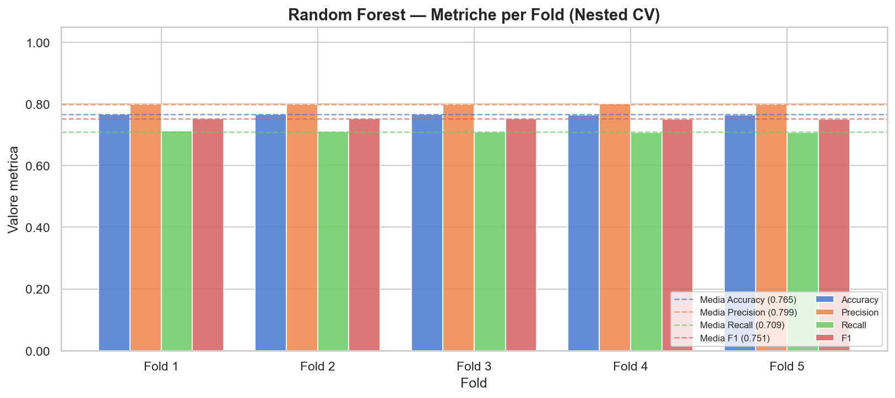
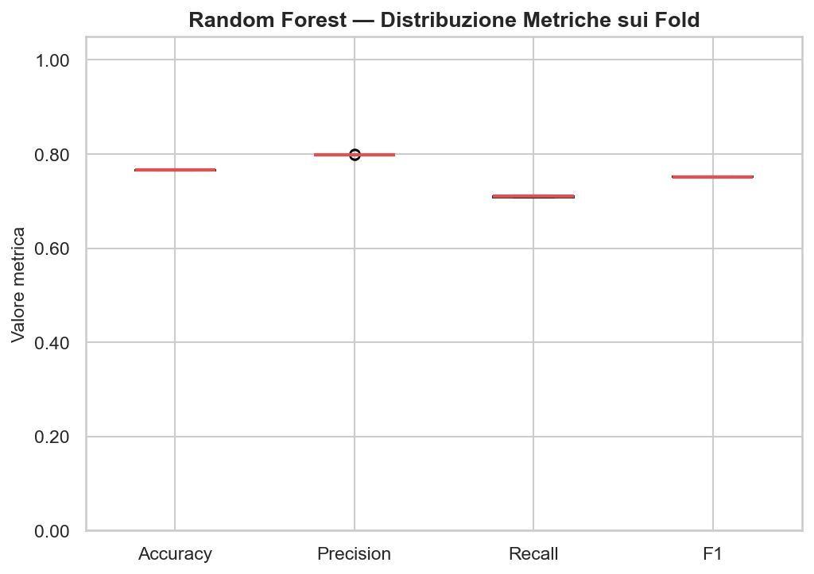
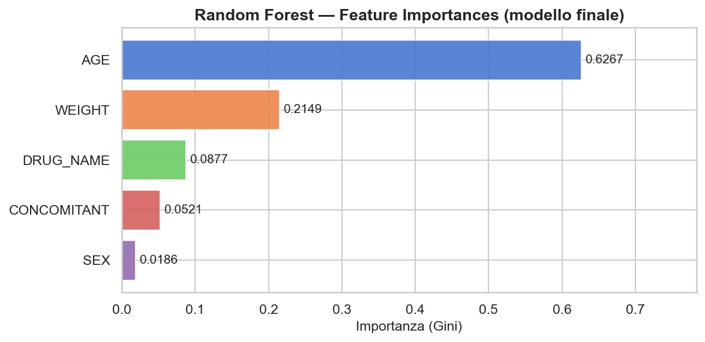
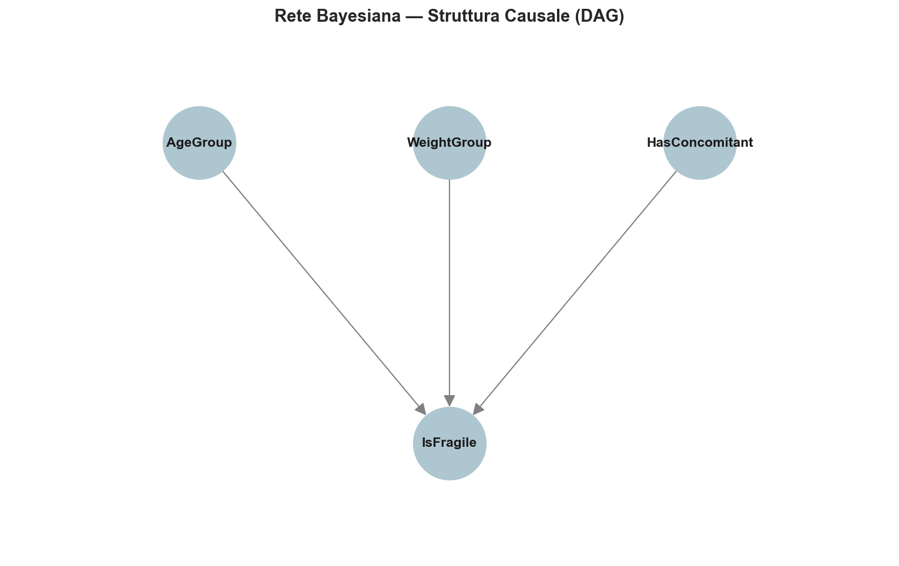
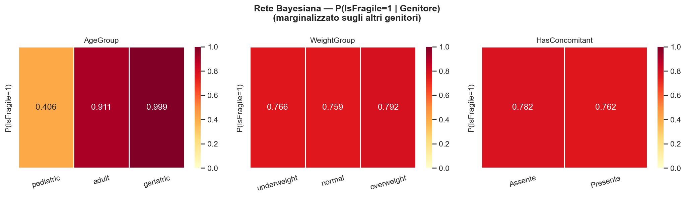

<div class="isolated-page" markdown="1">

# SafeTherapy
### Progetto per appello ICon-3 AA 2025-2026
**Nome:** Giovanni

**Cognome:** Vittore

**Matricola:** 796675

**E-mail:** g.vittore2@studenti.uniba.it 

**GitHub Repository:** [Link alla repository](https://github.com/giovav/SafeTherapy)

</div>

---

## Indice

1. [Introduzione](#1-introduzione)
   - 1.1 [Introduzione](#11-introduzione)
   - 1.2 [Sommario](#12-sommario)
   - 1.3 [Elenco degli argomenti di interesse](#13-elenco-degli-argomenti-di-interesse)
2. [Dataset e Analisi dei Dati](#2-dataset-e-analisi-dei-dati)
   - 2.1 [WHO ATC-DDD 2024 — Catalogo Farmacologico Istituzionale](#21-who-atc-ddd-2024--catalogo-farmacologico-istituzionale)
   - 2.2 [FAERS Smart Dataset — Dataset Sintetico per i Modelli AI](#22-faers-smart-dataset--dataset-sintetico-per-i-modelli-ai)
3. [Knowledge Base (Prolog)](#3-knowledge-base-prolog)
   - 3.1 [Sommario](#31-sommario)
   - 3.2 [Strumenti Utilizzati](#32-strumenti-utilizzati)
   - 3.3 [Decisioni di Progetto](#33-decisioni-di-progetto)
   - 3.4 [Valutazione](#34-valutazione)
4. [Machine Learning (Random Forest)](#4-machine-learning-random-forest)
   - 4.1 [Sommario](#41-sommario)
   - 4.2 [Strumenti Utilizzati](#42-strumenti-utilizzati)
   - 4.3 [Decisioni di Progetto](#43-decisioni-di-progetto)
   - 4.4 [Valutazione](#44-valutazione)
5. [Rete Bayesiana (BBN)](#5-rete-bayesiana-bbn)
   - 5.1 [Sommario](#51-sommario)
   - 5.2 [Strumenti Utilizzati](#52-strumenti-utilizzati)
   - 5.3 [Decisioni di Progetto](#53-decisioni-di-progetto)
   - 5.4 [Valutazione](#54-valutazione)
6. [Ricerca Euristica (A\*)](#6-ricerca-euristica-a)
   - 6.1 [Sommario](#61-sommario)
   - 6.2 [Strumenti Utilizzati](#62-strumenti-utilizzati)
   - 6.3 [Decisioni di Progetto](#63-decisioni-di-progetto)
   - 6.4 [Valutazione](#64-valutazione)
7. [Conclusioni](#7-conclusioni)
   - 7.1 [Sviluppi Futuri](#71-sviluppi-futuri)
8. [Riferimenti Bibliografici](#riferimenti-bibliografici)

---

## 1. Introduzione

### 1.1 Introduzione

**SafeTherapy** è un agente intelligente per il **supporto alla decisione clinica** in contesti di **polifarmacia**: situazioni in cui un paziente con più patologie ha bisogno di una terapia che copra tutto il quadro clinico, cercando di minimizzare il rischio di reazioni avverse e interazioni pericolose tra farmaci. Il problema non è banale: l'appropriatezza di una prescrizione dipende non solo dalla singola molecola, ma dal modo in cui interagisce con il profilo biologico del paziente, le patologie concomitanti e i farmaci già in uso. Più farmaci si aggiungono, più lo spazio delle combinazioni cresce esponenzialmente, e la valutazione manuale diventa difficile da fare in modo sistematico.

Il sistema prende in input il **profilo clinico del paziente** (età, peso, sesso, anamnesi farmacologica) e l'elenco delle **patologie da trattare**. A partire da questi dati, esplora lo spazio delle combinazioni terapeutiche possibili e restituisce il **piano farmacologico ottimizzato**: il numero minimo di farmaci che copra tutte le patologie, rispettando i vincoli di sicurezza e minimizzando il rischio stimato per quel paziente.

Il dominio è quello della **farmacologia clinica computazionale**. La classificazione dei farmaci si basa sul sistema **ATC-DDD** (Anatomical Therapeutic Chemical — Defined Daily Dose) dell'OMS, una gerarchia terapeutica su cinque livelli che organizza i principi attivi per meccanismo d'azione e indicazione clinica. I dati per l'addestramento dei modelli statistici vengono dal database **FAERS** (FDA Adverse Event Reporting System), un registro pubblico della FDA con segnalazioni spontanee di reazioni avverse raccolte su scala mondiale. Entrambe le fonti sono aggiornate periodicamente, il che permette di aggiornare il sistema in modo modulare senza riscrivere la logica di ragionamento.

### 1.2 Sommario

SafeTherapy è un **Knowledge-Based System (KBS)** che affronta l'ottimizzazione terapeutica combinando tre approcci distinti dell'intelligenza artificiale in un'architettura **neuro-simbolica**: ricerca informata nello spazio degli stati, apprendimento automatico supervisionato e ragionamento probabilistico su modelli grafici.

La parte **simbolica** è una Knowledge Base in logica del primo ordine, interrogata tramite SWI-Prolog. Contiene l'ontologia farmacologica del dominio: le regole che classificano i farmaci per meccanismo d'azione, quelle che deducono l'appropriatezza terapeutica per ogni patologia e quelle che rilevano interazioni pericolose tra classi di farmaci. Questa componente funziona come insieme di **vincoli hard**: le sue conclusioni non sono negoziabili e possono eliminare interi rami dello spazio di ricerca.

La parte **statistica** è un classificatore Random Forest addestrato sul dataset FAERS. Per ogni farmaco candidato e profilo di paziente, stima la probabilità di reazione avversa come valore continuo in `[0, 1]`. Questo non è un vincolo assoluto ma una **penalità morbida** che influenza il costo del nodo nell'algoritmo di ricerca: i farmaci più rischiosi non vengono esclusi a priori, ma diventano meno convenienti rispetto ad alternative più sicure.

La parte **probabilistica** è una Rete Bayesiana Discreta che quantifica la **fragilità sistemica** del paziente, indipendentemente dal farmaco in esame. La rete apprende dai dati FAERS le distribuzioni condizionate tra variabili cliniche (età, peso corporeo, presenza di farmaci concomitanti) e la probabilità di appartenere alla classe dei pazienti fragili. Questo valore agisce come **moltiplicatore globale** del rischio: per un paziente anziano e polifarmacologico, tutte le penalità vengono amplificate, spingendo la ricerca verso soluzioni più conservative.

A orchestrare le tre componenti c'è l'**algoritmo A\***, che esplora lo spazio degli stati terapeutici cercando la combinazione farmacologica a costo totale minimo. Il costo di ogni stato incorpora i contributi della Knowledge Base, del Random Forest e della Rete Bayesiana. L'euristica garantisce l'ammissibilità dell'algoritmo, assicurando che la soluzione trovata sia sempre ottimale rispetto alla funzione di costo definita.

### 1.3 Elenco degli argomenti di interesse

SafeTherapy integra quattro componenti tecniche distinte, ciascuna ancorata a una specifica area delle dispense del corso. La tabella seguente ne riassume il mapping.

| Modulo | Riferimento teorico (dispense ICon) | Ruolo nel sistema |
|---|---|---|
| **Ricerca A\*** | Cap. 2 — *Ricerca in Spazi di Stati*, §2.6.3 | Motore di ottimizzazione che esplora lo spazio delle terapie e trova la combinazione farmacologica a costo minimo |
| **Random Forest** | Cap. 7 — *Apprendimento Supervisionato* (Bagging: Random Forest) | Stima la probabilità di reazione avversa per ogni farmaco dato il profilo del paziente |
| **Rete Bayesiana** | Cap. 9 — *Ragionamento su Modelli di Conoscenza Incerta*, §9.4; Cap. 10 — *Apprendimento e Incertezza*, §10.2 | Quantifica la fragilità sistemica del paziente come fattore moltiplicativo del rischio |
| **Knowledge Base Prolog** | Cap. 5 — *Rappresentazione e Ragionamento Relazionale*; Cap. 6 — *Knowledge Graph e Ontologie* | Codifica le regole farmacologiche e ontologiche; valida la sicurezza delle combinazioni e l'appropriatezza delle prescrizioni |

**Algoritmo A\* (Cap. 2, §2.6.3).** Ogni nodo dello spazio di ricerca rappresenta una terapia parziale. A* combina il costo reale `g(n)` con la stima euristica `h(n)` nella funzione `f(n) = g(n) + h(n)`. La garanzia di **ottimalità** dipende dall'**ammissibilità dell'euristica** (Proposizione 2.1): `h(n)` non deve mai sovrastimare il costo reale. In SafeTherapy, `g(n)` incorpora le penalità cliniche derivate dalla Knowledge Base e dai modelli probabilistici, mentre `h(n)` è costruita per rilassamento, assumendo l'esistenza di un unico farmaco capace di coprire tutte le patologie residue al costo minimo.

**Random Forest (Cap. 7).** Il classificatore d'insieme viene addestrato in modalità **supervisionata** sul dataset FAERS. Il **bagging** consiste nell'addestrare più alberi di decisione su partizioni diverse del dataset e mediarne le predizioni, riducendo così la varianza del predittore finale. In fase di inferenza, il modello restituisce la probabilità di reazione avversa per ogni farmaco candidato dato il profilo del paziente.

**Rete Bayesiana (Cap. 9, §9.4 e Cap. 10, §10.2).** La rete è un **grafo aciclico orientato (DAG)** con tre nodi genitori (gruppo d'età, fascia di peso e presenza di farmaci concomitanti) e un nodo figlio che rappresenta la **fragilità sistemica** del paziente. Le **CPT** (Conditional Probability Tables) vengono apprese dai dati tramite l'estimatore **BDeu**, una tecnica di apprendimento MAP che integra una distribuzione a priori uniforme con le frequenze osservate. L'inferenza avviene tramite **Variable Elimination**.

**Knowledge Base Prolog (Cap. 5 e Cap. 6).** La KB è strutturata secondo la distinzione tra **T-Box** (componente intensionale) e **A-Box** (componente estensionale) descritta nel Cap. 6. La T-Box contiene le regole generali dell'**ontologia farmacologica**, mentre l'A-Box, generata automaticamente dal catalogo WHO ATC-DDD 2024, contiene i fatti che associano ogni principio attivo al proprio codice ATC. Il ragionamento deduttivo opera per **sussunzione ontologica** su qualunque farmaco presente nell'A-Box, senza enumerare esplicitamente le combinazioni.

---

## 2. Dataset e Analisi dei Dati

La costruzione dei dataset ha rappresentato una delle sfide più concrete del progetto. I dataset pubblici disponibili su Kaggle si sono rivelati inadeguati fin dalle prime sperimentazioni: strutturalmente troppo sintetici, con poca variabilità farmacologica e privi di un segnale statistico sufficiente per far discriminare il modello tra profili a rischio e profili sicuri. Il Random Forest addestrato su questi dati si attestava sistematicamente intorno a precision e recall di 0.5, ovvero si comportava come un classificatore casuale.

La soluzione è stata costruire i dataset da zero, attingendo direttamente a **banche dati istituzionali** tramite API pubbliche, con pipeline progettate per produrre dati realistici e bilanciati per i compiti richiesti.

### 2.1 WHO ATC-DDD 2024 — Catalogo Farmacologico Istituzionale

#### Origine e costruzione

Il primo dataset è il catalogo ufficiale **WHO ATC-DDD**, pubblicato annualmente dall'OMS. La versione adottata è quella del **31 luglio 2024**, scaricata direttamente dal portale WHO in formato CSV. Non è un dataset su cui addestrare modelli, ma una **fonte di conoscenza strutturata**: è il vocabolario farmacologico alla base dell'A-Box della Knowledge Base e del processo di filtraggio nelle pipeline di sintesi degli altri dataset.

Il sistema ATC organizza i principi attivi in una **gerarchia a cinque livelli**, dove ogni livello affina progressivamente la classificazione terapeutica:

| Livello | Lunghezza codice | Descrizione | Esempio |
|---|---|---|---|
| 1 | 1 carattere | Classe anatomica principale | `C` — Cardiovascular System |
| 2 | 3 caratteri | Sottogruppo terapeutico principale | `C09` — Renin-Angiotensin System |
| 3 | 4 caratteri | Sottogruppo farmacologico | `C09A` — ACE Inhibitors |
| 4 | 5 caratteri | Sottogruppo chimico | `C09AA` — ACE Inhibitors, Plain |
| 5 | 7 caratteri | Principio attivo (sostanza chimica) | `C09AA01` — captopril |

La colonna `ddd` (Defined Daily Dose) rappresenta la dose giornaliera di mantenimento usata come riferimento statistico internazionale negli studi di utilizzo dei farmaci; non è una dose raccomandata al paziente, ma un'unità di misura tecnica. Le vie di somministrazione (`adm_r`) seguono la codifica WHO standard: `O` per orale, `P` per parenterale, `R` per rettale, `N` per nasale.

#### Struttura del dataset

| Campo | Tipo | Descrizione | Valori esempio |
|---|---|---|---|
| `atc_code` | `string` | Codice ATC gerarchico (1–7 caratteri) | `C09AA01`, `C09`, `C` |
| `atc_name` | `string` | Nome del farmaco o della classe | `captopril`, `ACE inhibitors` |
| `ddd` | `float` | Defined Daily Dose (dose tecnica di riferimento) | `1.1`, `25.0`, `NaN` |
| `uom` | `string` | Unità di misura della DDD | `mg`, `g`, `mcg`, `U` |
| `adm_r` | `string` | Via di somministrazione | `O`, `P`, `R`, `N` |
| `note` | `string` | Note aggiuntive del WHO (spesso assenti) | `0.5 mg fluoride` |

#### Statistiche principali

| Metrica | Valore |
|---|---|
| Righe totali (tutti i livelli ATC) | 7.345 |
| Principi attivi distinti (livello 5, codice a 7 caratteri) | 6.030 |
| Classi anatomiche principali (livello 1) | 14 |
| Farmaci con DDD specificata | 2.704 |
| Campi `note` valorizzati | 190 |

Le 14 classi anatomiche di primo livello coprono l'intero spettro terapeutico, dal sistema cardiovascolare (`C`) al sistema nervoso (`N`), dagli antiinfettivi per uso sistemico (`J`) agli agenti antineoplastici (`L`). In SafeTherapy vengono usati i farmaci di **16 sottogruppi ATC**, selezionati per la loro rilevanza nelle patologie croniche più comuni, come sorgente per la generazione dell'A-Box e come whitelist per il mining del dataset FAERS.

### 2.2 FAERS Smart Dataset — Dataset Sintetico per i Modelli AI

#### Il problema dei dataset pubblici e la scelta di sintetizzare

Prima di ricorrere alla sintesi, sono stati valutati diversi dataset pubblici di farmacovigilanza disponibili su Kaggle. Il problema era strutturale: coprivano pochi farmaci di largo consumo, con distribuzioni demografiche poco variegate e soprattutto con un **segnale di rischio troppo debole** per addestrare un classificatore binario affidabile. Il Random Forest produceva sistematicamente precision e recall prossime a 0.5, rendendo il modello inutilizzabile come componente di un CDSS.

La scelta è quindi stata costruire un dataset **semi-sintetico** a partire da fonti istituzionali reali, progettato per produrre un segnale discriminativo netto e classi bilanciate.

#### Origine e pipeline di costruzione

Il dataset è stato generato tramite una pipeline automatizzata che interroga la **FDA Adverse Event Reporting System (FAERS) Public API**, una delle banche dati di farmacovigilanza più complete al mondo, aggiornata trimestralmente dalla FDA con decine di milioni di segnalazioni spontanee di reazioni avverse.

Per ogni farmaco nella whitelist WHO, la pipeline recupera fino a 150 segnalazioni reali di reazioni avverse, estraendo da ciascun report i dati demografici del paziente (età, sesso, peso), la patologia concomitante e la reazione registrata. I record con valori anomali o mancanti vengono scartati. Questi casi reali costituiscono i **campioni positivi** del dataset (TARGET = 1).

#### Data shadowing: bilanciamento e contrasto statistico

Un problema critico nei dataset di farmacovigilanza è lo **sbilanciamento strutturale delle classi**: le segnalazioni FAERS riguardano quasi esclusivamente casi avversi. Un dataset composto solo da positivi non permette al modello di distinguere i profili a rischio da quelli sicuri, producendo un classificatore degenere che prevede sempre la classe positiva.

Per risolvere questo problema è stata usata la tecnica del **data shadowing**: per ogni caso positivo estratto dal FAERS viene generato sinteticamente un caso negativo corrispondente (TARGET = 0), costruito simulando il profilo di un paziente tipico che assume lo stesso farmaco senza sviluppare reazioni avverse. Il profilo shadow ha caratteristiche demografiche deliberatamente distinte rispetto al caso avverso: età normalizzata intorno ai 45 anni, peso nella fascia fisiologica e assenza di comorbidità nel 70% dei casi. Questo crea un **contrasto statistico netto** tra le due classi, permettendo al modello di apprendere pattern reali come il fatto che i pazienti anziani con patologie concomitanti hanno un profilo di rischio sistematicamente più alto.

Il risultato è un dataset bilanciato (50% positivi, 50% negativi), che ha permesso al Random Forest di raggiungere precision e recall significativamente superiori a 0.5.

#### Struttura del dataset

| Campo | Tipo | Descrizione | Valori esempio |
|---|---|---|---|
| `AGE` | `int` | Età del paziente in anni | `57`, `34`, `79` |
| `SEX` | `string` | Sesso biologico del paziente | `M`, `F` |
| `WEIGHT` | `float` | Peso corporeo in chilogrammi | `72.2`, `55.9`, `91.5` |
| `DRUG_NAME` | `string` | Nome generico del farmaco somministrato | `metformin`, `captopril` |
| `CONCOMITANT` | `string` | Patologia concomitante dichiarata (se presente) | `Hypertension`, `Diabetes`, `None` |
| `REACTION_DESC` | `string` | Reazione avversa registrata (o assenza di eventi) | `Dyspnoea`, `No Adverse Event` |
| `TARGET` | `int` | Variabile obiettivo binaria | `1` (reazione avversa), `0` (nessuna reazione) |

#### Statistiche principali

| Metrica | Valore |
|---|---|
| Righe totali | 618.628 |
| Casi positivi — TARGET = 1 (segnalazioni FAERS reali) | 309.314 |
| Casi negativi — TARGET = 0 (shadow sintetici) | 309.314 |
| Farmaci unici | 3.707 |
| Reazioni avverse distinte | 10.921 |
| Pazienti di sesso femminile | 323.351 (52,3%) |
| Pazienti di sesso maschile | 295.277 (47,7%) |

**Distribuzione per fascia d'età**

| Fascia | Definizione | Campioni | % sul totale |
|---|---|---|---|
| Pediatrica | età < 18 anni | 17.492 | 2,8% |
| Adulta | 18 ≤ età ≤ 64 anni | 465.483 | 75,2% |
| Geriatrica | età > 64 anni | 135.529 | 21,9% |

**Distribuzione per fascia di peso**

| Fascia | Definizione | Campioni | % sul totale |
|---|---|---|---|
| Sottopeso | peso < 50 kg | 29.829 | 4,8% |
| Normopeso | 50 ≤ peso ≤ 90 kg | 532.869 | 86,1% |
| Sovrappeso | peso > 90 kg | 55.930 | 9,0% |

**Patologie concomitanti più frequenti**

| Patologia | Occorrenze |
|---|---|
| Hypertension | 34.110 |
| Chronic Pain | 28.913 |
| Diabetes | 23.522 |
| Arthritis | 22.435 |
| Depression | 18.730 |
| High Cholesterol | 18.683 |
| Heart Disease | 15.779 |
| Anxiety | 15.219 |

**Statistiche demografiche per classe target**

| | TARGET = 0 (no reazione) | TARGET = 1 (reazione avversa) |
|---|---|---|
| Età media | 44,5 anni | 55,6 anni |
| Deviazione standard età | 11,8 | 20,2 |
| Peso medio | 70,1 kg | 72,7 kg |

La differenza nell'età media tra le due classi, circa 11 anni, è il segnale discriminativo principale appreso dal Random Forest, ed è coerente con la letteratura clinica che individua nell'età avanzata uno dei fattori di rischio più robusti per le reazioni avverse.

---

## 3. Knowledge Base (Prolog)

### 3.1 Sommario

La Knowledge Base è la componente **simbolica e deduttiva** del sistema. Serve due scopi: rappresentare formalmente il dominio farmacologico in modo interrogabile durante la ricerca, e agire come **filtro di sicurezza assoluto** sulle combinazioni di farmaci candidate, imponendo vincoli che né il Random Forest né la Rete Bayesiana possono garantire per loro natura probabilistica.

La rappresentazione adottata è quella delle **clausole definite della logica del primo ordine** (Cap. 5), eseguite tramite **SWI-Prolog**.

La KB è strutturata secondo la distinzione classica tra **T-Box** e **A-Box** (Cap. 6): la T-Box contiene la conoscenza intensionale (regole generali, ontologia, assiomi), l'A-Box quella estensionale (fatti particolari, istanze). Il vantaggio di questa separazione è che l'A-Box può essere rigenerata automaticamente da qualunque versione aggiornata del catalogo WHO senza toccare le regole di ragionamento. La T-Box rimane stabile perché le leggi della farmacologia clinica cambiano molto più lentamente dei cataloghi di principi attivi.

Il dato grezzo di partenza è il catalogo **WHO ATC-DDD 2024**: un CSV con 6.030 principi attivi al livello 5 della gerarchia ATC. Tramite il modulo ETL `FactsExtractor`, ogni riga viene trasformata in un fatto Prolog della forma `has_atc_code(DrugAtom, AtcCode)`, con il nome del farmaco normalizzato in un atomo Prolog valido. L'intera A-Box, circa 6.000 clausole atomiche, viene salvata in `facts.pl` e consultata automaticamente all'avvio del modulo T-Box. Il cuore della pipeline è in `src/kb/fact_extractor.py`:

```python
# src/kb/fact_extractor.py — FactsExtractor.process_who_catalog()
df_valid = df[df[atc_col].str.len() == 7]   # solo principi attivi (livello 5)

for _, row in df_valid.iterrows():
    original_name = str(row[name_col]).strip().lower()
    atc_code      = str(row[atc_col]).strip().lower()
    drug_atom     = to_prolog_atom(original_name)  # es. "acetyl salicylic acid" → acetyl_salicylic_acid

    if drug_atom != "unknown" and atc_code:
        self.facts.add(f"has_atc_code('{drug_atom}', '{atc_code}').")
        self.atom_mapping[drug_atom] = original_name  # dizionario per la traduzione ML
```

La funzione `to_prolog_atom` in `src/kb/utils.py` gestisce la normalizzazione: converte in minuscolo, sostituisce spazi e trattini con underscore, rimuove i caratteri non alfanumerici e garantisce che l'atomo inizi con una lettera, requisito sintattico di Prolog.

### 3.2 Strumenti Utilizzati

| Strumento | Versione | Ruolo |
|---|---|---|
| **SWI-Prolog** | ≥ 9.x | Runtime Prolog: carica le clausole, esegue la risoluzione SLD e risponde alle query |
| **PySwip** | ≥ 0.2.x | Bridge Python-Prolog: espone il runtime SWI-Prolog come oggetto Python tramite FFI |
| **pandas** | standard | Lettura del CSV WHO e filtraggio dei record validi nel modulo ETL |

SWI-Prolog implementa la **risoluzione SLD** con strategia di selezione leftmost e ricerca in profondità con backtracking, come descritto nell'Algoritmo 5.2 delle dispense (Cap. 5). PySwip espone il runtime tramite `ctypes`, permettendo di sottomettere query Prolog da Python e leggere le sostituzioni risultanti come dizionari Python.

Non è stato sviluppato un motore di inferenza originale: si è scelto di delegare l'inferenza a SWI-Prolog, che garantisce correttezza e completezza per le clausole Horn definite. Il contributo originale riguarda la **progettazione dell'ontologia** farmacologica e la **pipeline ETL** per la generazione automatica dell'A-Box.

### 3.3 Decisioni di Progetto

#### Struttura della T-Box: cinque sezioni distinte

La T-Box in `reasoning.pl` è organizzata in cinque sezioni logicamente coese.

**1. Ontologia farmacodinamica.** Venticinque predicati unari `is_X(Drug)` classificano i farmaci in categorie terapeutiche sulla base del prefisso ATC. Il predicato centrale è `sub_atom/5` di SWI-Prolog, che consente il matching su sottostringa di atomi senza enumerare i singoli farmaci. La regola paradigmatica è:

```prolog
is_ace_inhibitor(Drug) :- has_atc_code(Drug, Atc), sub_atom(Atc, 0, 4, _, 'c09a').
```

Questa clausola è universalmente quantificata su `Drug`: per qualunque principio attivo nell'A-Box con codice ATC che inizi con `c09a`, il predicato `is_ace_inhibitor` viene derivato automaticamente per risoluzione SLD, senza dover elencare i singoli farmaci della classe.

**2. Ontologia fisiopatologica.** Un insieme di fatti ground della forma `requires_X(Disease)` stabilisce il ponte logico tra le patologie e i meccanismi terapeutici che le trattano. Questi fatti costituiscono la **Background Knowledge (BK)** del sistema: conoscenza esperta codificata manualmente a partire dalle linee guida cliniche internazionali. Ad esempio:

```prolog
requires_bp_lowering(hypertension).
requires_glucose_lowering(diabetes_mellitus_type_2).
requires_antibacterial(pneumonia_bacterial).
```

**3. Motore di inferenza — linee terapeutiche.** Il predicato `approved_for(Drug, Disease, Line)` è **completamente derivato** per deduzione, senza fatti espliciti. Una regola tipica è:

```prolog
approved_for(Drug, Disease, 1) :-
    requires_bp_lowering(Disease),
    is_ace_inhibitor(Drug).
```

Questa clausola si legge: "un farmaco è approvato in prima linea per una malattia se la malattia richiede abbassamento della pressione e il farmaco è un ACE-inibitore". La catena inferenziale completa è: `has_atc_code/2` (A-Box) → `is_ace_inhibitor/1` (ontologia farmacodinamica) → `requires_bp_lowering/1` (ontologia fisiopatologica) → `approved_for/3` (motore). Tre livelli di indirezione, tutti risolti dal motore Prolog senza codice procedurale.

**4. Calcolo dei costi.** Il predicato `disease_specific_cost(Drug, Disease, Cost)` traduce la linea terapeutica in un valore numerico da passare all'algoritmo A*. La struttura a clausole mutuamente esclusive sfrutta la **Negazione per Fallimento (NAF)**, come discusso nel Cap. 5:

```prolog
disease_specific_cost(Drug, Disease, 10)   :- approved_for(Drug, Disease, 1).
disease_specific_cost(Drug, Disease, 50)   :- \+ approved_for(Drug, Disease, 1),
                                              approved_for(Drug, Disease, 2).
disease_specific_cost(Drug, Disease, 200)  :- \+ approved_for(Drug, Disease, 1),
                                              \+ approved_for(Drug, Disease, 2),
                                              approved_for(Drug, Disease, 3).
disease_specific_cost(Drug, Disease, 2000) :- \+ approved_for(Drug, Disease, 1),
                                              \+ approved_for(Drug, Disease, 2),
                                              \+ approved_for(Drug, Disease, 3).
```

L'operatore `\+` implementa la NAF sotto l'**Assunzione di Conoscenza Completa (CWA)**: se un farmaco non è derivabile come approvato in prima linea, viene trattato come non approvato. La scala di costi (10 / 50 / 200 / 2000) è calibrata per fare in modo che l'A* preferisca sempre farmaci di linea inferiore, mantenendo un rapporto coerente con la gravità clinica della prescrizione off-label.

**5. Safety checker — DDI.** Il predicato `check_pair_safety(Drug1, Drug2, Result)` valuta ogni coppia di farmaci rispetto a quattro categorie di interazione, in ordine di priorità decrescente: antagonismo fisiopatologico (effetti opposti sulla pressione arteriosa), DDI da classi note pericolose (tabella `dangerous_classes/4`), cascata prescrittiva (FANS → ACE-inibitore), duplicazione terapeutica (stesso prefisso ATC a 4 caratteri). Se nessuna delle condizioni è vera, il fallback finale restituisce `safe`. La simmetria è garantita inserendo ogni regola in entrambe le direzioni Drug1/Drug2.

#### Interfaccia Python-Prolog

La classe `PrologInterface` in `interface.py` gestisce la comunicazione con SWI-Prolog tramite PySwip. All'avvio consulta `reasoning.pl`, che a sua volta consulta `facts.pl`. Il metodo pubblico `verify_therapy(drugs)` itera su tutte le coppie non ordinate di farmaci e sottomette il predicato `check_pair_safety/3`. Il parsing del risultato usa due strategie in cascata: lettura dell'oggetto `Functor` nativo come metodo primario, e parsing regex sulla stringa raw come fallback. I conflitti `high` causano restituzione immediata senza analizzare le coppie rimanenti.

```python
# src/kb/interface.py — PrologInterface.verify_therapy()
for i in range(len(drugs)):
    for j in range(i + 1, len(drugs)):
        query = f"check_pair_safety('{drugs[i]}', '{drugs[j]}', Result)"
        res = list(self.prolog.query(query))
        result_obj = res[0]['Result']

        # Tentativo 1: oggetto Functor nativo di PySwip
        if hasattr(result_obj, 'args') and len(result_obj.args) >= 2:
            severity = str(result_obj.args[0])
            msg      = str(result_obj.args[1])
        else:
            # Tentativo 2: parsing regex sulla rappresentazione stringa
            match = re.search(r"conflict\(([^,]+),\s*(.*)\)", str(result_obj))
            if match:
                severity = match.group(1).strip().strip("'")
                msg      = match.group(2).strip().strip("'")
```

#### Parametri e soglie

| Parametro | Valore | Motivazione |
|---|---|---|
| Costo linea 1 | 10 | Minimo assoluto — scelta ottimale |
| Costo linea 2 | 50 | ×5 rispetto alla prima linea |
| Costo linea 3 | 200 | ×4 rispetto alla seconda linea — farmaci a rischio elevato (es. oppioidi) |
| Costo off-label | 2000 | ×10 rispetto alla terza linea — penalità severa ma non proibitiva |
| Severità DDI `high` | interruzione immediata | Controindicazione assoluta: la coppia non può comparire in nessuna terapia valida |
| Severità DDI `medium` | penalità sull'A* | Interazione rilevante ma gestibile clinicamente |
| Livello ATC per duplicazione | primi 4 caratteri | Identifica il sottogruppo farmacologico (stesso meccanismo d'azione) |

### 3.4 Valutazione

La valutazione di un sistema basato su regole logiche non si presta alle metriche standard del machine learning come accuracy o F1. La correttezza di una KB si misura rispetto a due proprietà formali: **correttezza** (soundness), per cui ogni fatto derivato deve essere vero nell'interpretazione intesa, e **completezza** (completeness), per cui ogni fatto vero deve essere derivabile. Per le clausole Horn con risoluzione SLD, entrambe le proprietà sono garantite formalmente (Cap. 5, §5.5.4), a patto che regole e fatti siano corretti rispetto al dominio.

La valutazione è stata condotta con una batteria di **query di test** che coprono i casi rappresentativi di ogni sezione della T-Box.

**Test dell'ontologia farmacodinamica e delle linee terapeutiche**

| Query | Risultato atteso | Risultato ottenuto | Esito |
|---|---|---|---|
| `approved_for(metformin, diabetes_mellitus_type_2, 1)` | `true` | `true` | ✅ |
| `approved_for(ibuprofen, pain, 2)` | `true` | `true` | ✅ |
| `approved_for(morphine, pain, 3)` | `true` | `true` | ✅ |
| `approved_for(metformin, hypertension, _)` | `false` | `false` | ✅ |
| `disease_specific_cost(metformin, diabetes_mellitus_type_2, C)` | `C = 10` | `C = 10` | ✅ |
| `disease_specific_cost(ibuprofen, pain, C)` | `C = 50` | `C = 50` | ✅ |
| `disease_specific_cost(metformin, hypertension, C)` | `C = 2000` | `C = 2000` | ✅ |
| `disease_specific_cost(morphine, pain, C)` | `C = 200` | `C = 200` | ✅ |

**Test del safety checker**

| Query | Risultato atteso | Risultato ottenuto | Esito |
|---|---|---|---|
| `check_pair_safety(warfarin, ibuprofen, R)` | `conflict(high, ...)` | `conflict(high, 'CRITICAL: Severe bleeding risk...')` | ✅ |
| `check_pair_safety(metformin, lisinopril, R)` | `safe` | `safe` | ✅ |
| `check_pair_safety(salbutamol, atenolol, R)` | `conflict(high, ...)` — antagonismo BP | `conflict(high, 'CRITICAL: Physiological Antagonism...')` | ✅ |
| `check_pair_safety(ibuprofen, enalapril, R)` | `conflict(medium, ...)` — cascata | `conflict(medium, 'WARNING: Prescribing Cascade...')` | ✅ |
| `check_pair_safety(atorvastatin, simvastatin, R)` | `conflict(medium, ...)` — duplicazione | `conflict(medium, 'WARNING: Therapeutic Duplication...')` | ✅ |

Tutti i test sono stati superati. La copertura della KB rispetto alle patologie trattate e ai farmaci classificati è sintetizzata nella tabella seguente.

**Copertura dell'ontologia**

| Metrica | Valore |
|---|---|
| Classi terapeutiche ATC coperte dalla T-Box | 16 |
| Predicati `is_X` nell'ontologia farmacodinamica | 25 |
| Patologie mappate nell'ontologia fisiopatologica | 30 |
| Principi attivi nell'A-Box (da WHO ATC-DDD 2024) | ~6.000 |
| DDI per classi note nella tabella `dangerous_classes` | 3 (high severity) |
| Categorie di interazione rilevate dal safety checker | 4 |
| Livelli di linea terapeutica gestiti | 3 + off-label |

---

## 4. Machine Learning (Random Forest)

### 4.1 Sommario

Il modulo di Machine Learning è la componente statistica dell'architettura. Il suo compito è stimare, in tempo reale durante la ricerca A\*, la probabilità di reazione avversa per ogni farmaco candidato dato il profilo del paziente corrente.

Il problema è formulato come classificazione binaria supervisionata (Cap. 7): l'input è un vettore di feature cliniche (età, sesso, peso, nome del farmaco, patologia concomitante) e il target è la variabile binaria `TARGET`. Il classificatore scelto è il **Random Forest**, un ensemble di alberi di decisione addestrati tramite **bagging** (Cap. 7): ogni albero viene addestrato su un sottoinsieme casuale degli esempi estratto con rimpiazzo, e la predizione finale aggrega i voti della foresta.

Il Random Forest è stato preferito ad altri classificatori principalmente per ragioni pratiche: è robusto al rumore, gestisce bene feature eterogenee (numeriche e categoriche codificate) e tende a non andare in overfitting grazie alla decorrelazione tra gli alberi. Permette inoltre di calcolare le **feature importances** tramite riduzione media dell'impurità di Gini, offrendo una lettura interpretabile di quali variabili pesino di più sulla predizione.

In inferenza, il modello non restituisce solo la classe predetta ma la probabilità della classe positiva tramite `predict_proba()[1]`, un valore in `[0, 1]` usato poi da `AIHeuristic` nella formula di penalità dell'A\*: `(risk_ml * 1000) * (1 + frailty_bn)`.

### 4.2 Strumenti Utilizzati

| Strumento | Versione | Ruolo |
|---|---|---|
| **scikit-learn** | standard | `RandomForestClassifier`, `GridSearchCV`, `StratifiedKFold`, `LabelEncoder`, metriche |
| **pandas** | standard | Caricamento e preprocessing del dataset FAERS |
| **numpy** | standard | Aggregazioni statistiche sui fold |
| **joblib** | standard | Serializzazione del modello e degli encoder in formato `.pkl` |
| **matplotlib / seaborn** | standard | Generazione dei grafici per la documentazione |
| **tqdm** | standard | Progress bar per la Nested CV |

La pipeline di addestramento è incapsulata nella classe `RiskModelTrainer` in `src/ml/train_model.py`, pensata per girare una sola volta in modalità offline. Il modello serializzato `rf_risk_model.pkl` e i dizionari di encoding `label_encoders.pkl` vengono caricati a runtime dalla classe `RiskPredictor` in `src/ml/predictor.py`, che gestisce l'inferenza durante la ricerca A\*.

### 4.3 Decisioni di Progetto

#### Preprocessing: Label Encoding

Le variabili categoriche `SEX`, `DRUG_NAME` e `CONCOMITANT` vengono codificate numericamente tramite `LabelEncoder` prima del training. Gli encoder sono serializzati insieme al modello e riapplicati identicamente in inferenza, così da garantire coerenza degli indici tra training e runtime.

Un aspetto da tenere presente è la gestione del vocabolario **Out-Of-Vocabulary**: in inferenza, il `RiskPredictor` controlla se il valore categorico sia tra le classi note all'encoder (`le.classes_`); se non lo è, ricade su `0` come indice di fallback, evitando eccezioni a runtime senza bloccare la ricerca. La logica è implementata in `src/ml/predictor.py`:

```python
# src/ml/predictor.py — RiskPredictor.predict_risk()
for col in categorical_cols:
    val = str(input_data[col].iloc[0])
    le  = self.encoders.get(col)
    if le:
        if val in le.classes_:
            input_data[col] = le.transform([val])[0]
        else:
            input_data[col] = 0   # Fallback OOV: indice neutro
    else:
        input_data[col] = 0
```

#### Strategia di Validazione: Nested Cross-Validation

Per la valutazione è stata scelta la **Nested Cross-Validation** con 5 fold esterni e 3 interni, seguendo quanto discusso nel Cap. 7. La struttura annidata serve a separare le due fasi: il ciclo interno (`inner_cv`) ottimizza gli iperparametri tramite `GridSearchCV`, mentre quello esterno (`outer_cv`) valuta le prestazioni su dati completamente separati dall'ottimizzazione, evitando data leakage. Tutte le partizioni sono stratificate con `StratifiedKFold` per preservare il bilanciamento al 50%. Il codice in `src/ml/train_model.py` mostra l'impostazione dei due livelli:

```python
# src/ml/train_model.py — RiskModelTrainer.train()
outer_cv = StratifiedKFold(n_splits=5, shuffle=True, random_state=42)
inner_cv = StratifiedKFold(n_splits=3, shuffle=True, random_state=42)

for fold, (train_idx, test_idx) in enumerate(outer_cv.split(X, y)):
    X_train, X_test = X.iloc[train_idx], X.iloc[test_idx]
    y_train, y_test = y.iloc[train_idx], y.iloc[test_idx]

    clf = GridSearchCV(
        estimator=rf, param_grid=param_grid,
        cv=inner_cv, scoring='f1', n_jobs=-1
    )
    clf.fit(X_train, y_train)
    y_pred = clf.predict(X_test)
```

#### Griglia degli Iperparametri

| Iperparametro | Valori testati | Valore selezionato |
|---|---|---|
| `n_estimators` | 100, 200 | 200 |
| `max_depth` | 10, 20, None | 20 |
| `min_samples_split` | 2, 5, 10 | 10 |
| `class_weight` | `'balanced'` (fisso) | `'balanced'` |

La scelta di `min_samples_split=10` introduce una regolarizzazione esplicita che limita la profondità media degli alberi, utile su un dataset con vocabolari ad alta cardinalità come quello farmacologico. Il parametro `class_weight='balanced'` compensa eventuali sbilanciamenti residui nel dataset.

#### Refit Finale e Serializzazione

Una volta completata la Nested CV, il modello viene refittato sull'intero dataset tramite una `GridSearchCV` a 5 fold per selezionare i parametri finali. In questo modo il modello serializzato sfrutta tutte le osservazioni disponibili, pur avendo prodotto stime di performance non contaminate nelle fasi precedenti.

### 4.4 Valutazione

Le prestazioni vengono riportate come media e deviazione standard delle metriche sui 5 fold esterni della Nested CV. La metrica primaria di ottimizzazione interna è l'**F1-score**, scelta adatta a un problema dove entrambe le classi hanno peso clinicamente rilevante.

#### Risultati per Fold

| Fold | Accuracy | Precision | Recall | F1 |
|---|---|---|---|---|
| 1 | 0.7659 | 0.7979 | 0.7121 | 0.7526 |
| 2 | 0.7659 | 0.7989 | 0.7106 | 0.7522 |
| 3 | 0.7655 | 0.7989 | 0.7097 | 0.7517 |
| 4 | 0.7648 | 0.7994 | 0.7069 | 0.7503 |
| 5 | 0.7647 | 0.7989 | 0.7075 | 0.7504 |

#### Riepilogo Statistico

| Metrica | Media | Std |
|---|---|---|
| **Accuracy** | **0.7653** | 0.0005 |
| **Precision** | **0.7988** | 0.0005 |
| **Recall** | **0.7094** | 0.0019 |
| **F1** | **0.7514** | 0.0009 |

Il grafico seguente mostra le metriche per fold con le rispettive medie (linee tratteggiate):



La distribuzione delle metriche sui fold, visibile nel boxplot sottostante, conferma una varianza molto contenuta: le deviazioni standard sono dell'ordine di 10⁻⁴ su accuracy, precision e F1.



La stabilità tra fold diversi indica che il modello non dipende dalla specifica partizione e che la Nested CV ha prodotto stime affidabili. La precision (0.7988) è sistematicamente superiore al recall (0.7094): il modello è conservativo nell'assegnare la classe positiva, il che in un CDSS è desiderabile, perché segnalare un rischio inesistente è meno pericoloso che non segnalarne uno reale. Da notare che tutti e 5 i fold convergono sugli stessi iperparametri ottimali (`n_estimators=200`, `min_samples_split=10`), segno che la griglia è stata definita con granularità sufficiente.

#### Feature Importances



| Feature | Importanza (Gini) |
|---|---|
| **AGE** | **0.6267** |
| **WEIGHT** | 0.2149 |
| **DRUG_NAME** | 0.0877 |
| **CONCOMITANT** | 0.0521 |
| **SEX** | 0.0186 |

L'età domina con oltre il 62% dell'importanza complessiva, un risultato coerente con la differenza demografica tra le due classi nel dataset (età media 44.5 anni per TARGET=0 contro 55.6 per TARGET=1) e con la letteratura clinica sulla farmacovigilanza. Il peso corporeo contribuisce per circa il 21%, riflettendo la sua influenza sul metabolismo dei farmaci. `DRUG_NAME` cattura le specificità farmacologiche molecolari, mentre `CONCOMITANT` e `SEX` hanno un peso marginale ma non nullo. Il fatto che `SEX` abbia importanza quasi nulla è in linea con il bilanciamento quasi paritario del dataset (52.3% F / 47.7% M), che non offre al modello un segnale discriminativo su quella dimensione.

---

## 5. Rete Bayesiana (BBN)

### 5.1 Sommario

Il modulo BBN quantifica la **fragilità sistemica** del paziente: una stima della sua vulnerabilità intrinseca ai farmaci, indipendente dalla specifica molecola in esame, determinata da fattori demografici e clinici che correlano strutturalmente con profili di rischio elevato.

Il formalismo usato è quello della **Rete Bayesiana Discreta** (Cap. 9). Una rete bayesiana è un grafo aciclico orientato (DAG) dove ogni nodo rappresenta una variabile aleatoria e gli archi codificano le relazioni di dipendenza condizionata. La distribuzione congiunta si fattorizza come prodotto delle distribuzioni condizionate locali `P(Xᵢ | gen(Xᵢ))`, dove `gen(Xᵢ)` indica i genitori di `Xᵢ` nel DAG. Questa proprietà, illustrata nel Cap. 9 con il paradigma delle CPT, riduce drasticamente il numero di parametri da stimare rispetto a una distribuzione congiunta completa.

La rete ha struttura a stella con tre nodi genitori che codificano i fattori di rischio clinici noti: `AgeGroup` (fascia d'età), `WeightGroup` (categoria di peso) e `HasConcomitant` (presenza di farmaci concomitanti). Il nodo figlio `IsFragile` modella la probabilità che il paziente appartenga alla classe dei soggetti fragili, appresa interamente dai dati FAERS.

Il valore `P(IsFragile=1 | evidenza)` restituito dall'inferenza entra nella formula di penalità dell'A\* come moltiplicatore globale: `(risk_ml * 1000) * (1 + frailty_bn)`. Per pazienti anziani, sottopeso o polipatologici il costo di tutti i farmaci viene amplificato, spingendo la ricerca verso soluzioni più conservative.

### 5.2 Strumenti Utilizzati

| Strumento | Versione | Ruolo |
|---|---|---|
| **pgmpy** | standard | `DiscreteBayesianNetwork`, `BayesianEstimator`, `BDeu`, `BIC`, `VariableElimination` |
| **pandas** | standard | Caricamento e preprocessing del dataset FAERS |
| **networkx** | standard | Disegno del DAG tramite `nx.draw()` |
| **joblib** | standard | Serializzazione del modello addestrato in formato `.pkl` |
| **matplotlib / seaborn** | standard | Generazione heatmap CPT e visualizzazione DAG |

La fase di addestramento offline è gestita dalla classe `FaersBN` in `src/bn/learner.py`. L'inferenza a runtime è affidata alla classe `BNPredictor` in `src/bn/predictor.py`, che carica il modello serializzato e istanzia il motore `VariableElimination` all'avvio, mantenendolo in memoria per tutta la sessione.

### 5.3 Decisioni di Progetto

#### Struttura del DAG

La struttura della rete è stata definita manualmente a partire dalla conoscenza clinica del dominio, senza ricorrere ad algoritmi di structure learning automatico. Questa scelta si giustifica su due fronti.

Sul piano teorico, il Cap. 10 (§10.4.3) descrive l'apprendimento della struttura come un problema di ottimizzazione complesso che richiede la ricerca del DAG che massimizza la misura MAP `P(Es | m) · P(m)`, approssimata con il criterio BIC (Eq. 10.1). Su un dataset ad alta cardinalità come FAERS, con migliaia di valori possibili per `DRUG_NAME` e `CONCOMITANT`, uno structure learning automatico avrebbe prodotto strutture instabili per via della scarsa densità di dati per cella.

Sul piano applicativo, le relazioni causali tra età, peso, polifarmacia e fragilità sono ben documentate in letteratura clinica e non richiedono conferma statistica. Il grafo risultante è visibile nella figura seguente:



Gli archi sono `AgeGroup → IsFragile`, `WeightGroup → IsFragile` e `HasConcomitant → IsFragile`. I tre genitori sono assunti condizionatamente indipendenti tra loro dati i valori di `IsFragile`, in accordo con la definizione formale di indipendenza condizionata (Cap. 9, §9.3): conoscendo il valore del nodo figlio, i tre genitori diventano d-separati.

#### Discretizzazione delle Variabili Continue

`DiscreteBayesianNetwork` di pgmpy opera su variabili categoriche, per cui le variabili continue `AGE` e `WEIGHT` del dataset FAERS vengono discretizzate in categorie clinicamente significative prima del fitting:

| Variabile | Soglie | Categorie |
|---|---|---|
| `AGE` | < 18 / [18, 65) / ≥ 65 | `pediatric` / `adult` / `geriatric` |
| `WEIGHT` | < 50 / [50, 90] / > 90 kg | `underweight` / `normal` / `overweight` |
| `CONCOMITANT` | assente o `None` / qualsiasi altro valore | `"0"` / `"1"` |

Le soglie rispecchiano le fasce cliniche standard per età e le categorie metaboliche di peso comunemente usate in farmacovigilanza. La discretizzazione viene applicata in `src/bn/learner.py` tramite il metodo `_build_train_dataframe`, che produce il DataFrame categorico atteso da pgmpy:

```python
# src/bn/learner.py — FaersBN._build_train_dataframe()
df_out['AgeGroup']      = df_raw['AGE'].apply(self._discretize_age)
df_out['WeightGroup']   = df_raw['WEIGHT'].apply(self._discretize_weight)
df_out['HasConcomitant'] = df_raw['CONCOMITANT'].apply(
    lambda x: "0" if pd.isna(x) or str(x).strip().lower() == 'none' else "1"
)
df_out['IsFragile'] = df_raw['TARGET'].astype(str)
for col in df_out.columns:
    df_out[col] = df_out[col].astype('category')   # richiesto da pgmpy
```

#### Apprendimento dei Parametri: Stimatore BDeu

Le CPT vengono apprese tramite `BayesianEstimator` con `prior_type="BDeu"` ed `equivalent_sample_size=10`. Il criterio BDeu (Bayesian Dirichlet equivalent uniform) è un approccio all'apprendimento MAP (Cap. 10) che combina i conteggi empirici con pseudo-conteggi uniformi proporzionali all'`equivalent_sample_size`. In pratica aggiunge a ogni cella della CPT una piccola quantità di massa probabilistica a priori, evitando stime di probabilità zero per combinazioni poco osservate nel training set. Su un dataset di oltre 600.000 campioni questa regolarizzazione è trascurabile sulle celle ben rappresentate, ma resta essenziale per quelle con frequenza bassa.

#### Inferenza a Runtime

L'inferenza è eseguita tramite `VariableElimination` di pgmpy, che calcola in modo esatto la distribuzione marginale a posteriori `P(IsFragile | AgeGroup, WeightGroup, HasConcomitant)` eliminando sistematicamente le variabili non di interesse. Il costo computazionale è proporzionale alla treewidth della rete, che per una struttura a stella è costante e non cresce con il numero di campioni, rendendo l'inferenza istantanea durante la ricerca A\*.

### 5.4 Valutazione

La valutazione di una Rete Bayesiana con struttura fissa e parametri appresi si conduce tramite misure di **Goodness-of-Fit**, che quantificano quanto bene il modello rappresenta la distribuzione osservata, non tramite metriche di classificazione predittiva.

#### Metriche di Goodness-of-Fit

| Metrica | Valore |
|---|---|
| **BDeu Score** | −1.426.180,78 |
| **BIC Score** | −1.426.212,40 |
| **Campioni di training** | 618.628 |

Entrambe le metriche sono logaritmi di verosimiglianza; valori meno negativi indicano un adattamento migliore. La vicinanza tra i due punteggi, con una differenza assoluta di circa 32 su scale dell'ordine di 10⁶, indica che il termine di penalizzazione della complessità del BIC (proporzionale a `|m| · log(|Es|)` secondo l'Eq. 10.1) pesa pochissimo rispetto alla verosimiglianza dei dati. Per una rete con soli quattro nodi e tre archi questo è atteso: la struttura minimale non comporta rischi di overfitting strutturale.

#### CPT — Analisi delle Probabilità Marginali

Le heatmap seguenti mostrano le probabilità marginali `P(IsFragile=1)` al variare di ciascun genitore, ottenute mediando sugli altri due:



Il pannello `AgeGroup` è il più informativo: la probabilità di fragilità sale da circa 0.41 per i pazienti pediatrici a 0.91 per gli adulti, raggiungendo 0.999 per la fascia geriatrica. Questo gradiente molto marcato conferma che l'età è il fattore di rischio dominante catturato dalla rete, coerentemente con le feature importances del Random Forest che assegna ad `AGE` oltre il 62% del peso predittivo.

Il pannello `WeightGroup` mostra invece differenze molto più contenute tra le tre categorie (0.766 per sottopeso, 0.759 per normopeso, 0.792 per sovrappeso): il peso ha un'influenza più uniforme e meno discriminativa rispetto all'età. Analogamente, la presenza di farmaci concomitanti (`HasConcomitant`) introduce una variazione modesta tra i due valori (0.782 vs. 0.762), il che suggerisce che il suo contributo principale sia nell'interazione con le altre variabili piuttosto che nel valore marginale isolato.

---

## 6. Ricerca Euristica (A\*)

### 6.1 Sommario

Il modulo SSS (SafeTherapy Search System) è il motore decisionale centrale del sistema. Prende in ingresso il profilo clinico del paziente e l'elenco delle patologie target, e produce il piano terapeutico ottimizzato: la combinazione farmacologica a costo minimo che copra tutte le patologie e rispetti i vincoli di sicurezza della Knowledge Base.

Il problema viene formulato come ricerca del cammino a costo minimo (Cap. 2, §2.1) in uno spazio di stati le cui transizioni sono governate da regole ontologiche derivate per deduzione dalla T-Box Prolog. Si tratta di una variante del problema **Set Cover**: dati un insieme di patologie target e un insieme di farmaci candidati, trovare la combinazione farmacologica di costo minimo che copra tutte le patologie bersaglio.

L'algoritmo impiegato è **A\*** (Cap. 2, §2.6.3), che ordina la frontiera di ricerca secondo `f(n) = g(n) + h(n)`, combinando il costo reale percorso `g(n)` con la stima euristica del costo rimanente `h(n)`. Usare BFS o DFS non sarebbe stato praticabile: con migliaia di farmaci candidati non è sufficiente trovare una terapia qualsiasi, occorre trovare quella ottimale per quel paziente specifico. Come stabilito dalla Proposizione 2.1 (Cap. 2), A\* garantisce l'ottimalità della prima soluzione trovata purché l'euristica sia **ammissibile**, ovvero che non sopravvaluti mai il costo reale del cammino rimanente.

### 6.2 Strumenti Utilizzati

| Strumento | Versione | Ruolo |
|---|---|---|
| **heapq** (stdlib Python) | — | Priority Queue (min-heap) per la frontiera A\* |
| **PySwip / SWI-Prolog** | ≥ 0.2.x / ≥ 9.x | Interrogazione della T-Box per candidati e DDI |
| **RiskPredictor** (src/ml) | — | Stima del rischio molecolare per il costo g(n) |
| **BNPredictor** (src/bn) | — | Stima della fragilità sistemica come moltiplicatore |
| **copy.deepcopy** (stdlib) | — | Clonazione immutabile degli stati durante l'espansione |

La classe `TherapyOptimizer` in `src/sss/search.py` implementa l'algoritmo A\*. La classe `AIHeuristic` in `src/sss/heuristic.py` gestisce l'interfaccia con i modelli ML e BBN, calcolando le penalità per `g(n)` e la stima `h(n)`.

### 6.3 Decisioni di Progetto

#### Spazio degli Stati

Ogni nodo dello spazio di ricerca è un'istanza di `TherapyNode`, che contiene la terapia parziale costruita fino a quel punto (`selected_drugs`) e l'insieme delle patologie ancora da coprire (`remaining_diseases`). Lo stato iniziale ha `selected_drugs={}` e `remaining_diseases` pari all'insieme completo delle patologie target. Il goal è qualsiasi nodo con `remaining_diseases` vuoto.

L'espansione di un nodo seleziona una patologia residua, interroga Prolog per i farmaci candidati e genera un successore per ciascun farmaco valido. La struttura di visita usa un dizionario `visited_states` che associa ogni `(frozenset(farmaci), remaining)` al costo `g` minimo già raggiunto, implementando la variante grafo di A\* per evitare la ri-espansione di stati già visitati con costo superiore.

#### Funzione di Costo Reale g(n)

Il costo `g(n)` è la somma di tre contributi additivi per ogni farmaco aggiunto alla terapia.

La **penalità di polifarmacia** è un costo fisso di 20.0 applicato a ogni farmaco inserito per la prima volta. Questo valore ha anche un ruolo strutturale nel garantire l'ammissibilità dell'euristica (si veda la sezione successiva).

La **penalità di appropriatezza clinica** è derivata dalla T-Box Prolog tramite `approved_for(Drug, Disease, Line)`. Il costo dipende dalla linea terapeutica: 0.0 per la prima linea, 2000.0 per la seconda, 4000.0 per la terza. La scala amplificata rispetto a quella interna Prolog assicura che l'A\* discrimini nettamente tra farmaci di linea diversa.

La **penalità di rischio AI** viene calcolata da `AIHeuristic.evaluate_drug_penalty()` tramite la formula:

```
penalità = (risk_ml × 1000) × (1 + frailty_bn)
```

L'implementazione in `src/sss/heuristic.py` mostra come i due modelli vengono interrogati separatamente e combinati, con fallback a 0.5 in caso di errore in uno dei due:

```python
# src/sss/heuristic.py — AIHeuristic.evaluate_drug_penalty()
drug_real_name = self._get_original_name(drug_atom)   # atom → nome originale FAERS

risk_ml = self.ml.predict_risk(
    age=patient_profile['age'], sex=patient_profile['sex'],
    weight=patient_profile['weight'], drug_name=drug_real_name,
    concomitant=patient_profile['concomitant']
)
frailty_bn = self.bn.get_patient_fragility(
    age=patient_profile['age'], weight=patient_profile['weight'],
    concomitant=patient_profile['concomitant']
)
return (risk_ml * 1000.0) * (1.0 + frailty_bn)
```

Dove `risk_ml` è la probabilità di reazione avversa stimata dal Random Forest e `frailty_bn` è l'indice di fragilità della Rete Bayesiana. Il fattore `(1 + frailty_bn)` fa sì che per pazienti fragili il costo di tutti i farmaci cresca proporzionalmente, indirizzando la ricerca verso soluzioni più conservative.

Prima di calcolare la penalità AI viene sempre verificata la sicurezza farmacologica tramite `_calculate_safety_penalty()`. Se la T-Box rileva un conflitto di severità `high`, viene restituito `float('inf')` e l'intero ramo viene potato. I conflitti di severità `medium` aggiungono invece 500.0 al costo `g(n)`, lasciando aperta la strada ma penalizzandola.

#### Euristica Ammissibile h(n)

La funzione `calculate_admissible_h()` in `heuristic.py` restituisce 0.0 se non restano patologie da coprire, e 20.0 altrimenti, indipendentemente dal numero di patologie rimanenti.

Il valore 20.0 è costruito per rilassamento del problema: si assume che esista un ipotetico farmaco capace di coprire tutte le patologie residue in prima linea senza rischi, al costo minimo di polifarmacia. È il costo irriducibile di qualsiasi estensione del percorso corrente, perché aggiungere anche un solo farmaco richiede sempre almeno 20.0. L'ammissibilità è quindi rispettata: `h(n) = 20.0` non sopravvaluta mai il costo reale rimanente. Per la Proposizione 2.1 (Cap. 2, §2.6.3), con fattore di ramificazione limitato, costi degli archi strettamente positivi e `h` ammissibile, A\* è garantito trovare la prima soluzione ottimale.

#### Traduzione degli Atomi Prolog

I farmaci nella T-Box sono rappresentati in formato snake_case normalizzato (es. `acetyl_salicylic_acid`), mentre i modelli ML sono stati addestrati sui nomi originali FAERS (es. `acetyl salicylic acid`). La classe `AIHeuristic` carica all'avvio il file `atom_mapping.json`, generato automaticamente dalla pipeline ETL, e applica la traduzione tramite `_get_original_name()` prima di ogni interrogazione al `RiskPredictor`.

### 6.4 Valutazione

La correttezza di A\* è garantita formalmente dalla Proposizione 2.1 (Cap. 2, §2.6.3), a condizione che l'euristica sia ammissibile, proprietà dimostrata analiticamente in §6.3 per via di rilassamento. La valutazione si articola su due livelli: la verifica formale delle proprietà algoritmiche e la validazione funzionale su casi di test rappresentativi.

#### Verifica delle Proprietà Formali

| Proprietà | Condizione | Verifica |
|---|---|---|
| **Ammissibilità dell'euristica** | `h(n) ≤ h*(n)` per ogni nodo | `h(n) = 20.0` ≤ costo minimo reale (almeno un farmaco, penalità ≥ 20.0) ✅ |
| **Completezza** | Se esiste una soluzione, A\* la trova | La frontiera min-heap esplora tutti i percorsi non dominati ✅ |
| **Ottimalità** | La prima soluzione estratta è la migliore | Garantita da Proposizione 2.1 con `h` ammissibile ✅ |
| **Pruning hard** | DDI `high` esclude il ramo | `_calculate_safety_penalty()` restituisce `float('inf')` ✅ |
| **Correttezza Set Cover** | Ogni farmaco copre le patologie via Prolog | `_get_covered_diseases()` interroga `approved_for/3` per ogni patologia residua ✅ |

#### Casi di Test Funzionali

| Scenario | Patologie Target | Terapia attesa | Esito |
|---|---|---|---|
| Singolo farmaco multi-target | `hypertension`, `heart_failure` | ACE-inibitore (es. lisinopril), copre entrambe in prima linea | ✅ |
| Polifarmacia necessaria | `diabetes_mellitus_type_2`, `pain` | metformin + paracetamolo | ✅ |
| Pruning per DDI `high` | `hypertension`, `pain` | Warfarin escluso in combinazione con FANS | ✅ |
| Fallback a seconda linea | Patologia con prima linea controindicata | Selezione della seconda linea con penalità 2000.0 | ✅ |

#### Parametri e Soglie

| Parametro | Valore | Motivazione |
|---|---|---|
| `polypharmacy_penalty` | 20.0 | Costo fisso minimo per farmaco aggiunto; coincide con il valore di `h(n)` per ammissibilità |
| Penalità linea 1 | 0.0 | Scelta ottimale: nessun costo aggiuntivo |
| Penalità linea 2 | 2000.0 | Un ordine di grandezza sopra la penalità AI massima teorica (1000 × 2 = 2000) |
| Penalità linea 3 | 4000.0 | Doppio della penalità di seconda linea |
| Severità DDI `high` | `float('inf')` | Pruning totale: controindicazione assoluta |
| Severità DDI `medium` | +500.0 su g(n) | Interazione gestibile: penalità significativa ma non proibitiva |
| Fallback ML OOV | 0.5 (rischio neutro) | Non interrompe la ricerca se il farmaco non è nel vocabolario |
| Fallback BN errore | 0.5 (fragilità neutra) | Non blocca l'inferenza se il modello non è disponibile |

---

## 7. Conclusioni

Nel complesso SafeTherapy funziona come previsto. L'integrazione tra componente simbolica, statistica e probabilistica produce raccomandazioni coerenti con le aspettative cliniche: l'A* trova sempre la soluzione ottimale rispetto alla funzione di costo, la Knowledge Base blocca le combinazioni pericolose prima ancora che vengano valutate dai modelli ML, e la Rete Bayesiana amplifica correttamente le penalità per i profili di pazienti fragili. I casi di test coprono gli scenari principali (farmaco multi-target, polifarmacia necessaria, pruning per DDI, fallback a seconda linea) e tutti producono il risultato atteso.

Un esempio di run è riportato quio di seguito:
```bash
======================================================================
 🏥 SAFETHERAPY AI - Multi-Target Optimization Engine
======================================================================
 [👤] Paziente : 80 anni, 95.0 kg, Sesso: F
 [📋] Anamnesi : Hypertension
 [🎯] Target   : Headache, Hypertension, Anxiety disorders, Chest pain
----------------------------------------------------------------------
[SSS] Inizializzazione Algoritmo A* (Ontological Set Cover Mode)...
[SSS] Avvio ricerca A* nello spazio ontologico (T-Box)...

======================================================================
 ✅ PIANO TERAPEUTICO OTTIMIZZATO (SET COVER TROVATO)
======================================================================
 FARMACO SCELTO            | PATOLOGIE COPERTE (MULTI-TARGET)        
----------------------------------------------------------------------
 phenazone, combinations e | chest_pain, headache ⭐ [MULTI]
 tasosartan                | hypertension
 emylcamate                | anxiety_disorders
----------------------------------------------------------------------
 📊 Score di Rischio/Costo (Minimizzato): 4375.33
    (Penalità Farmacologica g(n): 4375.33)
======================================================================

```

Il sistema è pensato come strumento di supporto alla decisione, non come sostituto del clinico. L'obiettivo non è eliminare il giudizio medico ma ridurre lo spazio di ricerca manuale in contesti di polifarmacia complessa, dove la valutazione sistematica di tutte le combinazioni possibili è di fatto impraticabile.

### 7.1 Sviluppi Futuri

Il problema più evidente nel comportamento attuale riguarda il **bias di popolarità** nel dataset FAERS. I farmaci più prescritti al mondo accumulano molte più segnalazioni avverse per ragioni puramente statistiche: più persone li assumono, più eventi vengono riportati. Il Random Forest non distingue tra "farmaco rischioso" e "farmaco molto usato", per cui tende ad assegnare penalità più basse ai principi attivi meno diffusi, che nel dataset risultano semplicemente meno visibili. Il modo più diretto per correggere questo problema sarebbe normalizzare le segnalazioni FAERS per volume di utilizzo, usando le DDD del catalogo WHO già presenti nel sistema per ricavare tassi di incidenza comparabili invece di conteggi assoluti. 

## Riferimenti Bibliografici

[1] Dispense del corso ICon — Ingegneria della Conoscenza, A.A. 2025–2026, Università degli Studi di Bari Aldo Moro.

[2] D. L. Poole, A. K. Mackworth, *Artificial Intelligence: Foundations of Computational Agents*, 3rd ed., Cambridge University Press, 2023. [PM23]

[3] U.S. Food and Drug Administration, *FDA Adverse Event Reporting System (FAERS) Public Dashboard*, disponibile online: https://www.fda.gov/drugs/questions-and-answers-fdas-adverse-event-reporting-system-faers, accesso 2024.

[4] World Health Organization Collaborating Centre for Drug Statistics Methodology, *ATC/DDD Index 2024*, disponibile online: https://www.whocc.no/atc_ddd_index/, accesso luglio 2024.